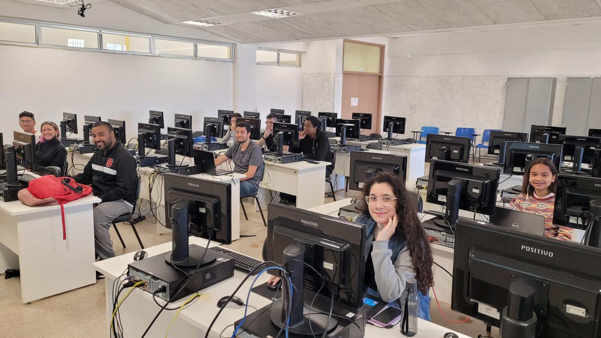
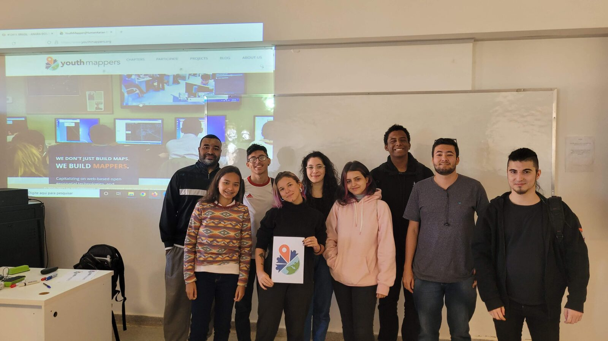
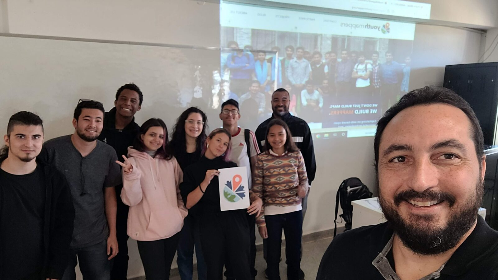

::: {.ficha}
Data
:   09/07/2022, das 21h às 23h

Local
:   Transmissão online via google meet

Participantes
:   10 estudantes

Parceiros
:   Grupo Meninas da Geo, Mapeadores Livres UFPR

Links
:   [Projeto no Tasking Manager](https://tasks.hotosm.org/projects/12411/)

:::

O Mapeamento na cidade de Angra dos Reis/RJ tem como objetivo incluir edifícios, estradas rurais, pontos de interesses (comércio em geral, escolas, postos de saúde, praças) e áreas verdes nos locais de mata, melhorando assim os dados do OpenStreetMap. 

## Área mapeada

<!-- Mapa interativo com Leaflet. Troque as coordenadas pelo centro
     da área mapeada (copie do openstreetmap.org: botão direito > Mostrar endereço). -->

```{=html}
<link rel="stylesheet" href="https://unpkg.com/leaflet@1.9.4/dist/leaflet.css">
<script src="https://unpkg.com/leaflet@1.9.4/dist/leaflet.js"></script>
<div id="mapa-evento" class="mapa" role="img" aria-label="Mapa da área mapeada no evento"></div>
<script>
  const mapa = L.map('mapa-evento').setView([-19.194, -46.247], 16);
  L.tileLayer('https://tile.openstreetmap.org/{z}/{x}/{y}.png', {
    maxZoom: 19,
    attribution: '&copy; colaboradores do <a href="https://www.openstreetmap.org/copyright">OpenStreetMap</a>'
  }).addTo(mapa);

  fetch('area.geojson')
  .then(r => r.json())
  .then(dados => {
    const area = L.geoJSON(dados, {
      style: { color: '#2e7d5b', weight: 2, fillOpacity: 0.15 }
    }).addTo(mapa);
    mapa.fitBounds(area.getBounds());
  });
</script>
```

## Fotos

Clique em uma foto para ampliar e use as setas para navegar.

::: {.galeria}
{group="mapathon" fig-alt="Abertura da atividade"}

{group="mapathon" fig-alt="Equipe"}

{group="mapathon" fig-alt="Equipe"}

:::
