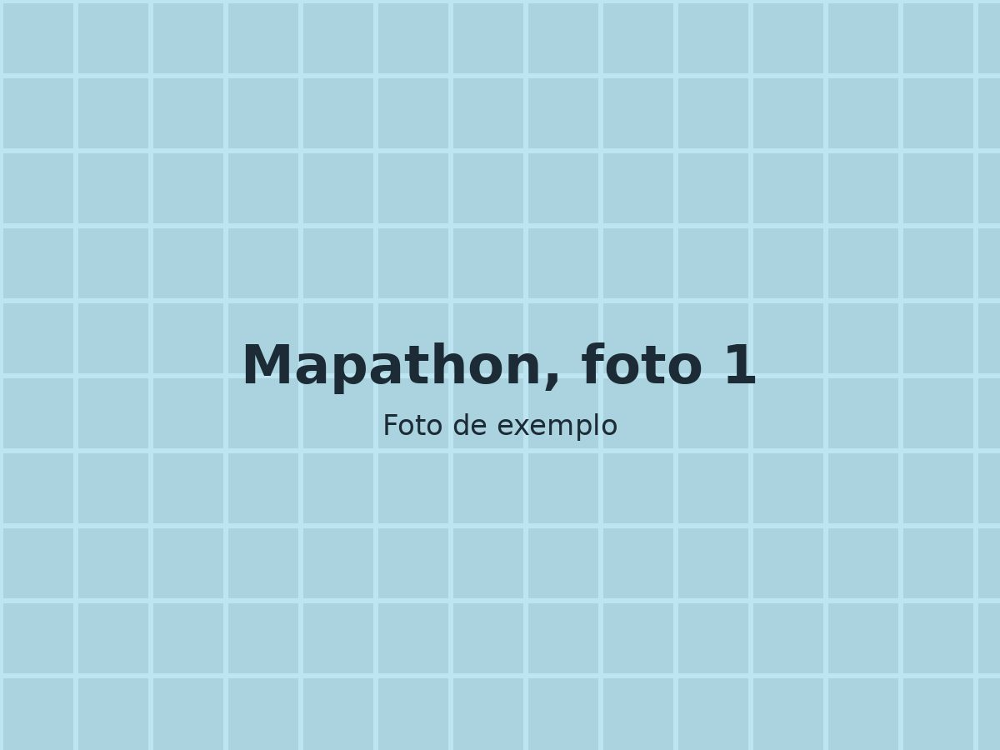
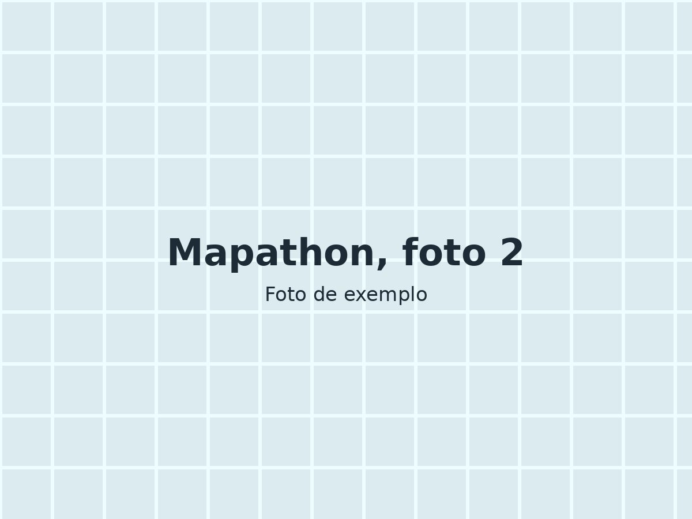
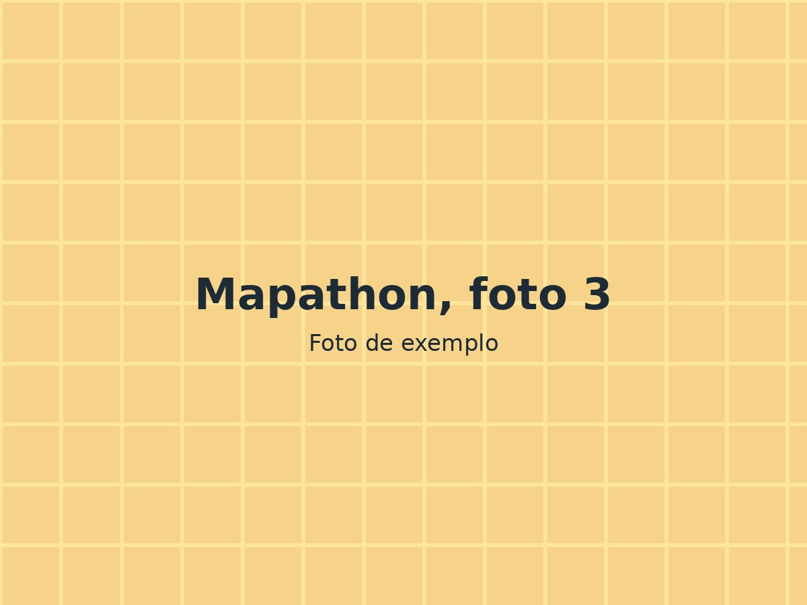
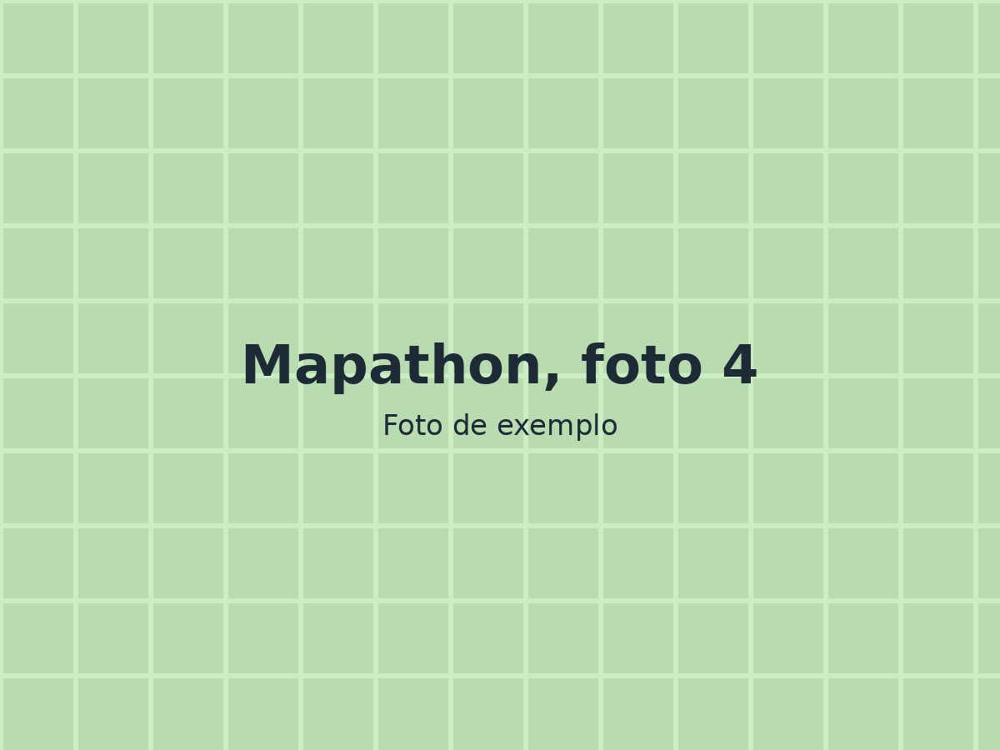
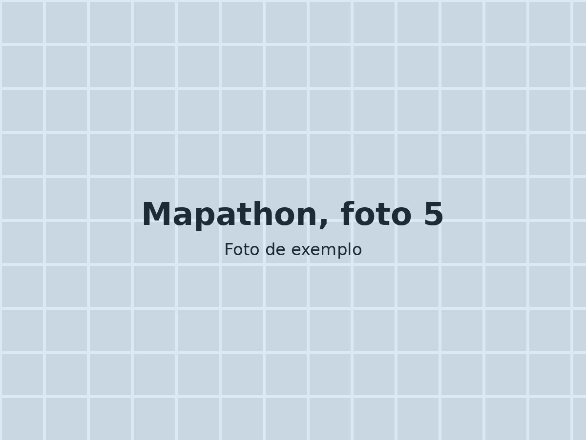
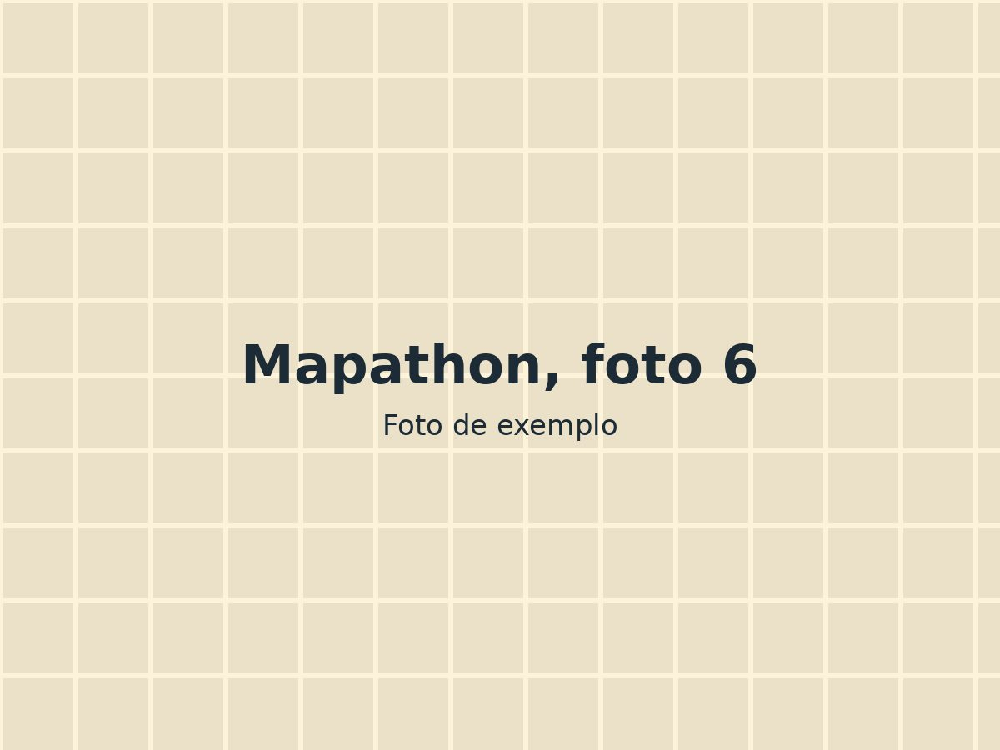

<!-- EVENTO DE EXEMPLO: mostra todos os recursos disponíveis.
     Para criar um evento novo, copie a pasta _modelos/evento/. -->

::: {.ficha}
Data
:   20/08/2026, das 14h às 18h

Local
:   Laboratório de Informática, UFV campus Rio Paranaíba

Participantes
:   25 estudantes

Parceiros
:   Prefeitura Municipal (exemplo)

Links
:   [Projeto no Tasking Manager](https://tasks.hotosm.org) e [álbum completo](https://example.com)
:::

Texto de exemplo descrevendo a ação: o que foi feito, quem participou, que dados foram produzidos e o que aconteceu depois. Escreva para quem não conhece o OpenStreetMap.

## Área mapeada

<!-- Mapa interativo com Leaflet. Troque as coordenadas pelo centro
     da área mapeada (copie do openstreetmap.org: botão direito > Mostrar endereço). -->

```{=html}
<link rel="stylesheet" href="https://unpkg.com/leaflet@1.9.4/dist/leaflet.css">
<script src="https://unpkg.com/leaflet@1.9.4/dist/leaflet.js"></script>
<div id="mapa-evento" class="mapa" role="img" aria-label="Mapa da área mapeada no evento"></div>
<script>
  const mapa = L.map('mapa-evento').setView([-19.194, -46.247], 16);
  L.tileLayer('https://tile.openstreetmap.org/{z}/{x}/{y}.png', {
    maxZoom: 19,
    attribution: '&copy; colaboradores do <a href="https://www.openstreetmap.org/copyright">OpenStreetMap</a>'
  }).addTo(mapa);
  // Retângulo de exemplo marcando a área do mapathon
  L.rectangle([[-19.197, -46.251], [-19.191, -46.243]],
              {color: '#7a1f21', weight: 2, fillOpacity: 0.15}).addTo(mapa);
</script>
```

## Fotos

Clique em uma foto para ampliar e use as setas para navegar.

::: {.galeria}
{group="mapathon" fig-alt="Abertura da atividade"}

{group="mapathon" fig-alt="Equipe em campo"}

{group="mapathon" fig-alt="Coleta de dados nas calçadas"}

{group="mapathon" fig-alt="Edição no OpenStreetMap"}

{group="mapathon" fig-alt="Validação dos dados"}

{group="mapathon" fig-alt="Foto do grupo"}
:::
